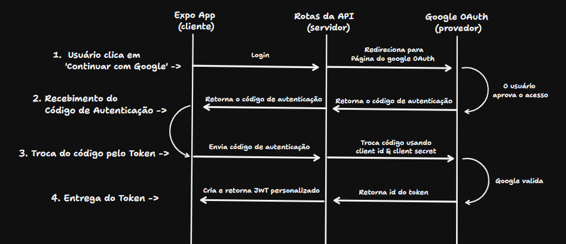

# 🔐 Autenticação Cross-Platform com Expo: Exemplo de Sign-In com Google

Este é um projeto [Expo](https://expo.dev) que demonstra uma arquitetura **BFF (Backend-for-Frontend)** para autenticação Google utilizando **Expo API Routes** e **JWTs**.

## Sobre

Este projeto foi desenvolvido como um exercício prático para **compreender os bastidores do processo de autenticação com o Google** em aplicações web e mobile. O objetivo principal foi explorar as funcionalidades do **Expo Router**, as ferramentas oferecidas pelo **Expo** e o fluxo de autenticação OAuth 2.0, que apresenta similaridades em diversas outras tecnologias.

## Funcionalidades

- 🔐 Autenticação Google
- 🎯 Arquitetura BFF com Expo API Routes
- 🎫 Gerenciamento de tokens via JWT (para mobile)
- 🎫 Gerenciamento de sessão via Cookies (para web)
- 📱 Suporte cross-platform (iOS, Android, Web)
- 🔄 Mecanismo de refresh de token
- 🛡️ Rotas de API protegidas

## 🚀 Demonstração do Projeto

Você pode testar o projeto em funcionamento no seguinte link:
[https://google-oauth.expo.app](https://google-oauth.expo.app)

## Pré-requisitos

- Projeto no [Google Cloud Console](https://console.cloud.google.com) com credenciais OAuth 2.0 configuradas.

## Este projeto suporta Cookies e Tokens

A utilização de tokens JWT é adequada para plataformas nativas, mas para aplicações web, o uso de cookies oferece vantagens significativas:

- **Segurança**: Cookies HTTP-only não podem ser acessados por JavaScript, protegendo contra ataques XSS.
- **Inclusão automática**: Cookies são enviados automaticamente em todas as requisições para o seu domínio.
- **Proteção CSRF**: Podem ser combinados com tokens CSRF para segurança adicional.
- **Gerenciamento de sessão**: Facilita a invalidação de sessões no lado do servidor.
- **Menos preocupações com armazenamento no cliente**: Elimina a necessidade de gerenciar o armazenamento de tokens em localStorage/sessionStorage.

A API de token detecta a plataforma e lida com a autenticação de forma apropriada:

- Para requisições web, define o token em um cookie HTTP-only seguro.
- Para requisições nativas, retorna o token na resposta.

## Fluxo de Autenticação Google OAuth 2.0

## Estrutura do Projeto

## Estrutura do Projeto

- `/app` - Código principal da aplicação, utilizando roteamento baseado em arquivos (Expo Router).
- `/api` - Rotas de API do backend (BFF - Backend For Frontend).
  - `/api/auth` - Endpoints de autenticação (ex: Google OAuth, troca de token).
  - `/api/protected` - Endpoints protegidos que requerem um token JWT válido.
- `/assets` - Arquivos estáticos como imagens, ícones e fontes.
- `/components` - Componentes React reutilizáveis da aplicação.
- `/constants` - Constantes globais para as cores.
- `/context` - Contextos React para gerenciamento de estado global.
- `/hooks` - Hooks React personalizados e reutilizáveis.
- `/utils` - Funções utilitárias diversas e middlewares.
- `app.json` - Arquivo de configuração principal do Expo.
- `.env.local` - Arquivo para variáveis de ambiente locais (não versionado).

---

---

## Saiba Mais

-   [Documentação do Expo](https://docs.expo.dev/)
-   [Expo Router](https://docs.expo.dev/router/introduction/)
-   [Google OAuth 2.0 para Aplicações Web do Lado do Servidor](https://developers.google.com/identity/protocols/oauth2/web-server)
-   [JWT.io](https://jwt.io/)
